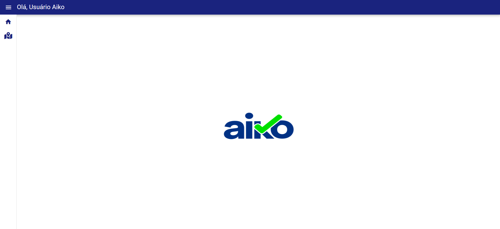
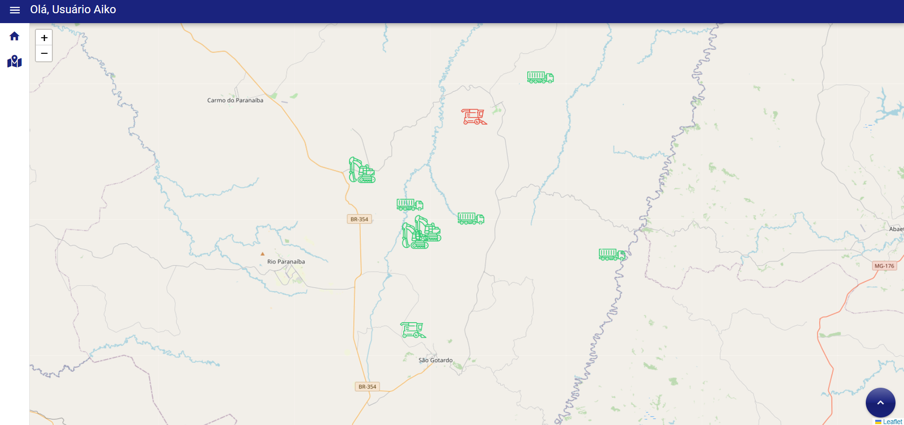
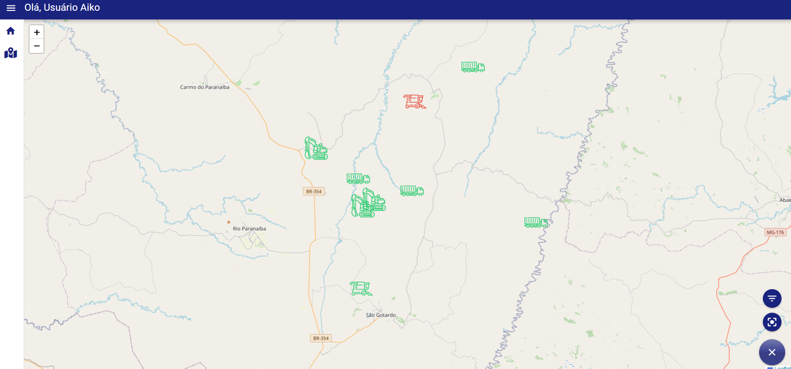
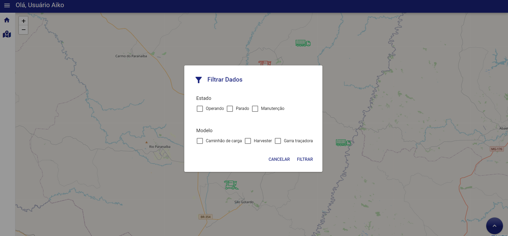
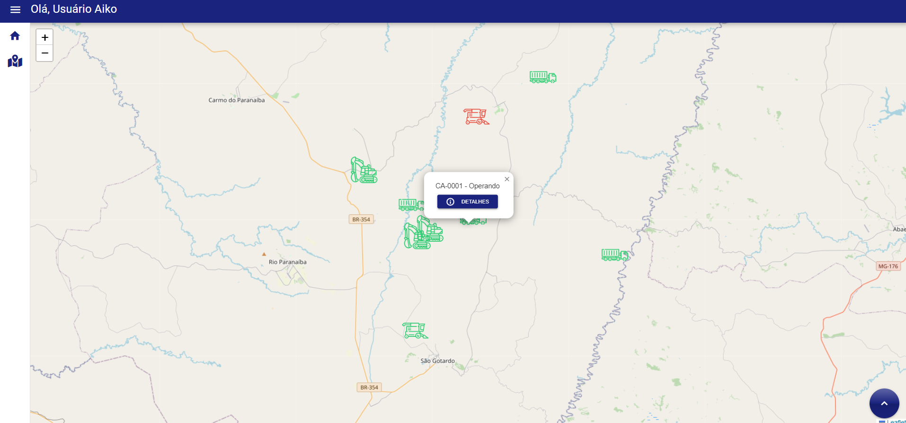
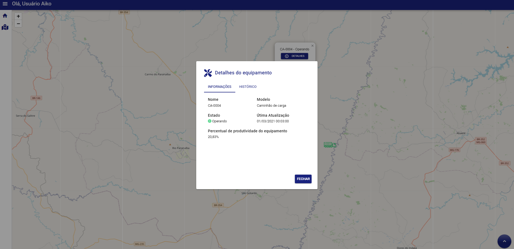
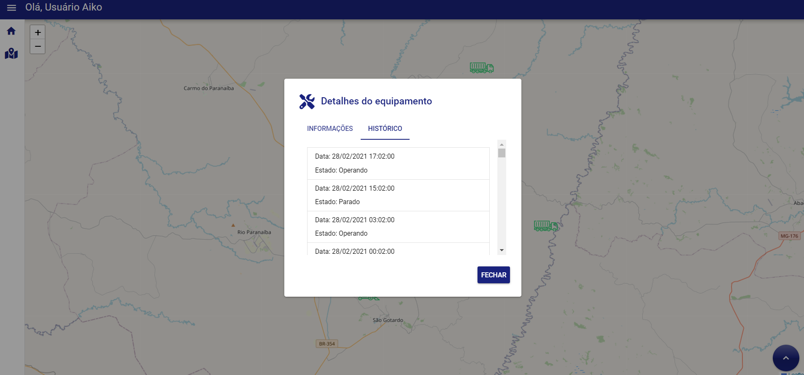

# Desafio FrontEnd Aiko

**Autor**: Silas Ribeiro dos Santos
**Data de Conclusão**: 18 de Setembro de 2024


## O Desafio

Você é o desenvolvedor frontend de uma empresa que coleta dados de equipamentos utilizados em uma operação florestal. Dentre esses dados estão o histórico de posições e estados desses equipamentos. O estado de um equipamento é utilizado para saber o que o equipamento estava fazendo em um determinado momento, seja _Operando_, _Parado_ ou em _Manutenção_. O estado é alterado de acordo com o uso do equipamento na operação, já a posição do equipamento é coletada através do GPS e é enviada e armazenada de tempo em tempo pela aplicação.

Seu objetivo é, de posse desses dados, desenvolver o frontend de aplicação web que trate e exibida essas informações para os gestores da operação.

## Considerações

Deixo aqui minhas considerações e obseravções quanto ao desenvolvimento aplicado ao projeto

- elaborei o projeto usando as seguintes tecnologias:
  - Javascript (Ainda estou evoluindo no TypeScript)
  - Quasar
  - VueJS (Versão 3)
  - Biblioteca Leaflet
  - Gerenciador de estados Pinia
  - Bun

### Tela Home



A tela Home foi feita para auxiliar o usuário a navegar pelo framework, verificando os menus laterais e as escolhas possíveis de se fazer

### Tela Mapa de Equipamentos



A tela Mapa de equipamentos é o local onde é focado a maior parte das funcionalidades do projeto. nela, é possível localizar os pontos dos equipamentos cadastrados na pasta "data" e realizar as seguintes funcionalidades:

- Filtrar a visualização por estado ou por modelo de equipamento
- Visualizar qual equipamento está sendo usado pelo ícone específico e em qual estado ele está, pela sua cor
- Clicar em cada equipamento e conseguir verificar seus detalhes de informação e o histórico de posição do mesmo

Seguem os prints abaixo:







## Passos para rodar o código

Clonar o Projeto para a máquina

```
git clone https://github.com/silassantos21/teste-frontend-v4.git
```

Ao entrar no projeto, instalar os pacotes

```
npm install
```

ou

```
yarn
```

ou

```
bun install
```

Rodar o projeto no quasar (ao ter o Quasar instalado)

```
npm run dev
```

ou

```
yarn dev
```

ou

```
quasar dev
```

ou

```
quasar dev
```
