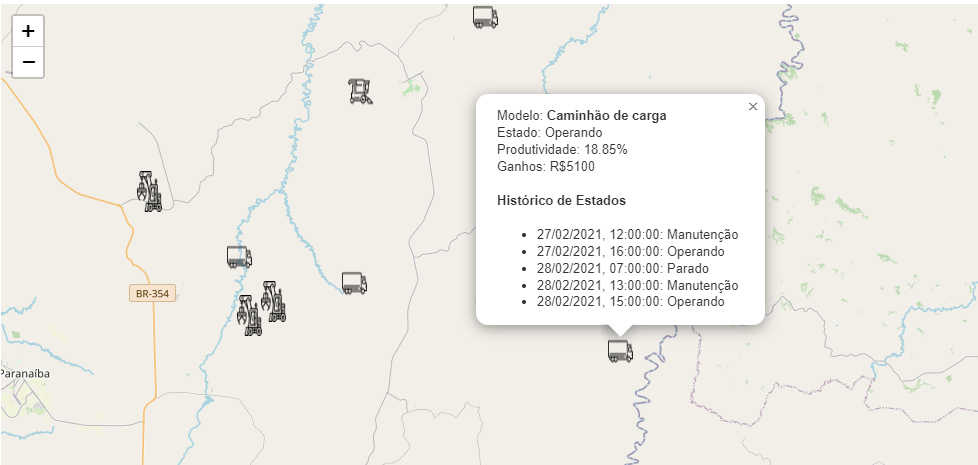

# **Equipament Map Application**

## **Descrição**
Esta aplicação exibe um mapa interativo onde é possível visualizar e filtrar equipamentos por modelo e estado. Além disso, possui um campo de busca para procurar por modelos específicos.

## **Funcionalidades**

- **Mapa Interativo:** Mostra a localização dos equipamentos no mapa.
  
- **Filtros:**
  - **Modelo:** Permite filtrar os equipamentos por modelo.
  - **Estado:** Permite filtrar os equipamentos por estado atual.
  
- **Campo de Busca:** Procure por um equipamento específico através do modelo.

## **Estrutura da Aplicação**

- **Mapa:** Exibe os equipamentos com base nos filtros aplicados.
- **Selects de Filtro:**
  - **Modelo:** Seleciona o modelo do equipamento a ser exibido.
  - **Estado:** Seleciona o estado do equipamento a ser exibido.
- **Campo de Busca:** Pesquisa equipamentos pelo modelo.

## **Como Usar**

1. Abra a aplicação.
2. Utilize os filtros para selecionar o modelo e estado dos equipamentos que deseja visualizar no mapa.
3. Utilize o campo de busca para encontrar equipamentos específicos pelo modelo.
4. Clique em um equipamento no mapa para visualizar mais detalhes.

## **Visualização de Popup**
Ao clicar em um equipamento no mapa, um popup será exibido com mais informações sobre o equipamento. Abaixo está uma captura de tela do popup:



## **Instalação e Execução**

1. Clone o repositório: 
    ```bash
    git clone https://github.com/BlackSheep1337/teste-frontend-v4
    ```
2. Instale as dependências: 
    ```bash
    npm install
    ```
3. Execute a aplicação: 
    ```bash
    npm start
    ```
