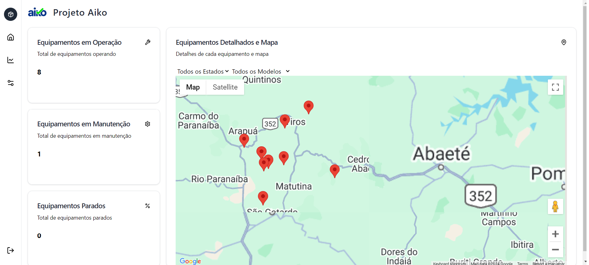
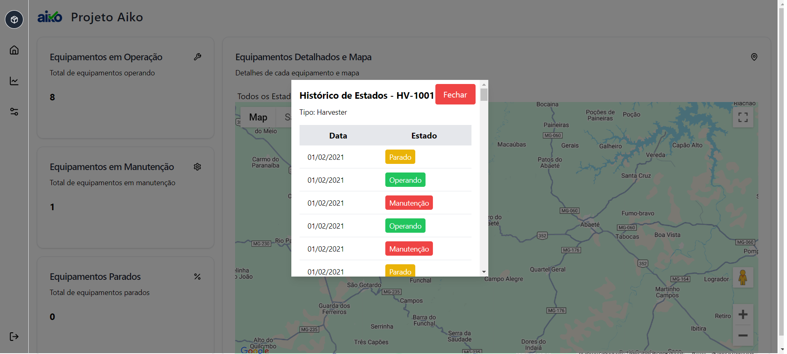
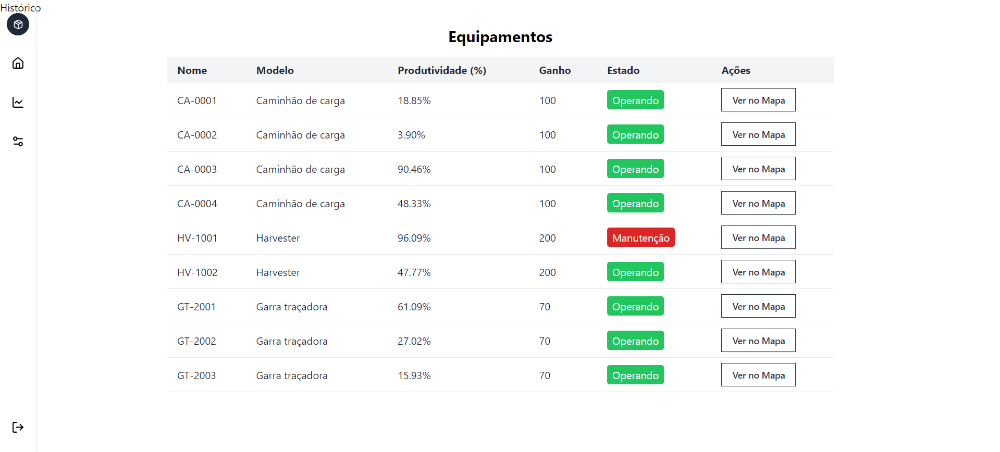
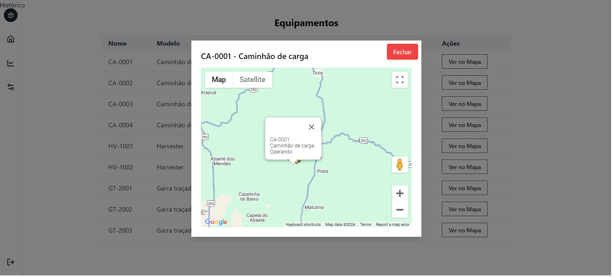

# Projeto de Gerenciamento de Equipamentos Florestais

Este projeto é uma aplicação web desenvolvida para gerenciar e monitorar equipamentos utilizados em operações florestais. O sistema fornece informações em tempo real sobre a localização, estado operacional e histórico de atividades dos equipamentos, facilitando a gestão e a tomada de decisões pelos operadores.

## 📋 Descrição do Projeto

A aplicação permite visualizar os dados dos equipamentos no mapa, incluindo suas posições mais recentes e estado atual. Também é possível acessar o histórico de estados, visualizar os modelos de equipamentos, calcular ganhos por hora e contar quantos equipamentos estão em determinados estados, como "Operando", "Manutenção" e "Parado".

# Imagens do projeto






## 🔧 Tecnologias Utilizadas

O projeto foi desenvolvido utilizando as seguintes tecnologias:

- **React**: Biblioteca JavaScript para construção de interfaces de usuário.
- **Next.js**: Framework React para desenvolvimento de aplicações web com renderização do lado do servidor (SSR) e rotas simplificadas.
- **TypeScript**: Superset do JavaScript que adiciona tipagem estática opcional ao código, ajudando a prevenir erros e melhorar a manutenção.
- **Zustand**: Biblioteca de gerenciamento de estado leve e flexível para React, usada para gerenciar o estado da aplicação.
- **Tailwind CSS**: Framework utilitário para estilização, facilitando a criação de interfaces modernas e responsivas.
- **Shadcn UI**: Biblioteca de componentes UI que utiliza Tailwind CSS para construir interfaces customizáveis.
- **@react-google-maps/api**: Biblioteca para integração do Google Maps com React, usada para exibir a localização dos equipamentos.
- **Jest**: Framework de testes utilizado para automatizar e validar o comportamento da aplicação, garantindo a qualidade e a consistência do código.

## 🚀 Funcionalidades Implementadas

- **Carregamento de Dados JSON**: Os dados dos equipamentos, modelos, estados e históricos são carregados a partir de arquivos JSON.
- **Visualização de Dados no Mapa**: Exibição das posições dos equipamentos no mapa com informações detalhadas sobre o estado atual.
- **Histórico de Estados**: Consulta ao histórico de estados dos equipamentos, mostrando a evolução ao longo do tempo.
- **Cálculo de Ganhos por Hora**: Cálculo dos ganhos por hora com base no modelo do equipamento e seu estado operacional.
- **Contagem de Equipamentos por Estado**: Contagem de equipamentos que estão em um determinado estado operacional, como "Operando", "Manutenção" ou "Parado".

## 🔧 Configuração de Variáveis de Ambiente

Para que a aplicação funcione corretamente, é necessário configurar algumas variáveis de ambiente. Essas variáveis são usadas para armazenar informações sensíveis e específicas do ambiente de desenvolvimento, como chaves de API e URLs de serviços externos.

### Arquivo `.env.local`

Crie um arquivo `.env.local` na raiz do projeto e adicione as seguintes variáveis:

```env
# URL da API base utilizada para fazer requisições de dados.
NEXT_PUBLIC_API_URL=https://api.seuservico.com

# Chave da API do Google Maps
NEXT_PUBLIC_GOOGLE_MAPS_API_KEY=sua_chave_google_maps

# Outro exemplo de variável de ambiente que pode ser necessária
NEXT_PUBLIC_OTHER_VARIABLE=valor
```

### Variáveis de Ambiente Utilizadas

1. **`NEXT_PUBLIC_API_URL`**: Define a URL base da API que a aplicação utilizará para buscar dados. Esta URL deve ser a mesma utilizada em produção.
2. **`NEXT_PUBLIC_GOOGLE_MAPS_API_KEY`**: Chave da API do Google Maps usada para carregar os mapas na aplicação. Essa chave é necessária para utilizar as funcionalidades do Google Maps, como exibir a posição dos equipamentos no mapa.
3. **`NEXT_PUBLIC_OTHER_VARIABLE`**: Descrição do uso dessa variável, se necessário.

### ⚠️ Importante

- **Nunca** compartilhe o arquivo `.env.local` ou qualquer variável de ambiente sensível em um repositório público.
- As variáveis de ambiente com o prefixo `NEXT_PUBLIC_` são acessíveis tanto no servidor quanto no navegador. Use-as apenas para variáveis que não contêm informações sensíveis. Para variáveis que devem ser protegidas, evite usar o prefixo `NEXT_PUBLIC_` e mantenha-as apenas no lado do servidor.

### Como Usar as Variáveis de Ambiente

No código da aplicação, você pode acessar as variáveis de ambiente usando `process.env.NOME_DA_VARIAVEL`. Exemplo:

```javascript
const apiUrl = process.env.NEXT_PUBLIC_API_URL;
const googleMapsApiKey = process.env.NEXT_PUBLIC_GOOGLE_MAPS_API_KEY;
```

### Exemplos de Configuração

- Para desenvolvimento local:
  ```env
  NEXT_PUBLIC_API_URL=http://localhost:3000/api
  NEXT_PUBLIC_GOOGLE_MAPS_API_KEY=sua_chave_local
  NEXT_PUBLIC_OTHER_VARIABLE=valor_local
  ```

- Para ambiente de produção:
  ```env
  NEXT_PUBLIC_API_URL=https://api.seuservico.com
  NEXT_PUBLIC_GOOGLE_MAPS_API_KEY=sua_chave_producao
  NEXT_PUBLIC_OTHER_VARIABLE=valor_producao
  ```

## 🛠️ Como Executar o Projeto

Para rodar o projeto localmente, siga os passos abaixo:

1. Clone o repositório:
   ```bash
   git clone https://github.com/seu-usuario/nome-do-repositorio.git
   ```
2. Acesse o diretório do projeto:
   ```bash
   cd nome-do-repositorio
   ```
3. Instale as dependências:
   ```bash
   npm install
   ```
4. Configure as variáveis de ambiente conforme descrito acima.
5. Inicie o servidor de desenvolvimento:
   ```bash
   npm run dev
   ```
6. Abra o navegador e acesse `http://localhost:3000` para visualizar a aplicação.

## 🗂️ Estrutura de Pastas

- **/app**: Contém a estrutura principal da aplicação, incluindo layouts e configuração de páginas.
  - **/fonts**: Armazena fontes utilizadas na aplicação.
  - **/history**: Armazena componentes ou módulos relacionados ao histórico da aplicação.
  - **favicon.ico**: Ícone utilizado na aba do navegador.
  - **head.tsx**: Componente que define metadados e informações da `head` HTML.
  - **HomePage.test.tsx**: Testes unitários relacionados à página inicial.
  - **layout.tsx**: Componente de layout que organiza a estrutura visual da aplicação.
  - **page.tsx**: Página principal da aplicação.
- **/components**: Contém componentes reutilizáveis da interface.
- **/lib**: Funções utilitárias e módulos auxiliares utilizados na aplicação.
- **/store**: Gerenciamento de estado da aplicação utilizando Zustand.
- **/styles**: Arquivos de estilo (CSS).
  - **input.css**: Arquivo de entrada para configuração de estilos Tailwind.
  - **output.css**: Arquivo de saída gerado pelo Tailwind com os estilos processados.
- **/types.ts**: Definições de tipos TypeScript utilizadas no projeto.
- **.env**: Arquivo de configuração de variáveis de ambiente.
- **.eslintrc.json**: Configuração de linting para garantir a padronização do código.
- **.gitignore**: Arquivo que especifica quais arquivos e pastas devem ser ignorados pelo Git.
- **components.json**: Configurações relacionadas aos componentes do projeto.
- **jest.config.js**: Configurações para testes com Jest.
- **next-env.d.ts**: Tipos TypeScript para Next.js.
- **next.config.mjs**: Configurações específicas do Next.js.

## 🤝 Contribuição

Contribuições são bem-vindas! Sinta-se à vontade para abrir issues e pull requests com melhorias, correções de bugs ou novas funcionalidades.

## 📝 Licença

Este projeto está licenciado sob a licença MIT. Consulte o arquivo [LICENSE](LICENSE) para mais informações.

## 📞 Contato

Para mais informações, entre em contato com o desenvolvedor:

- **Nome:** Lucas Silvestre
- **Email:** lucassilvestreadv@gmail.com  
- **LinkedIn:** [lucassilvestreee](https://www.linkedin.com/in/lucassilvestreee/)
