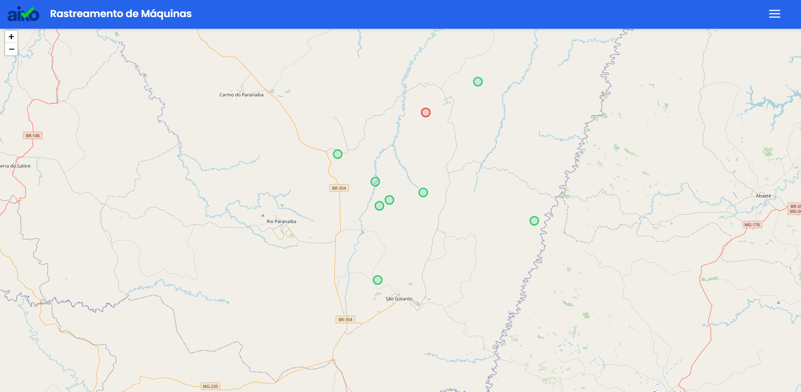
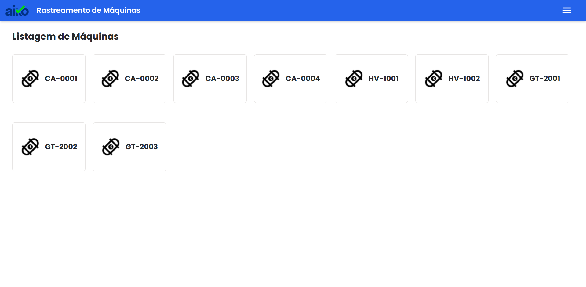
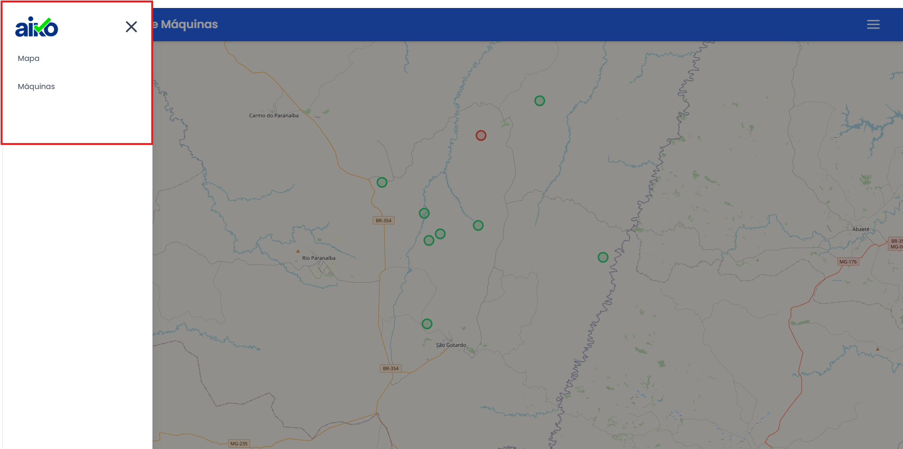
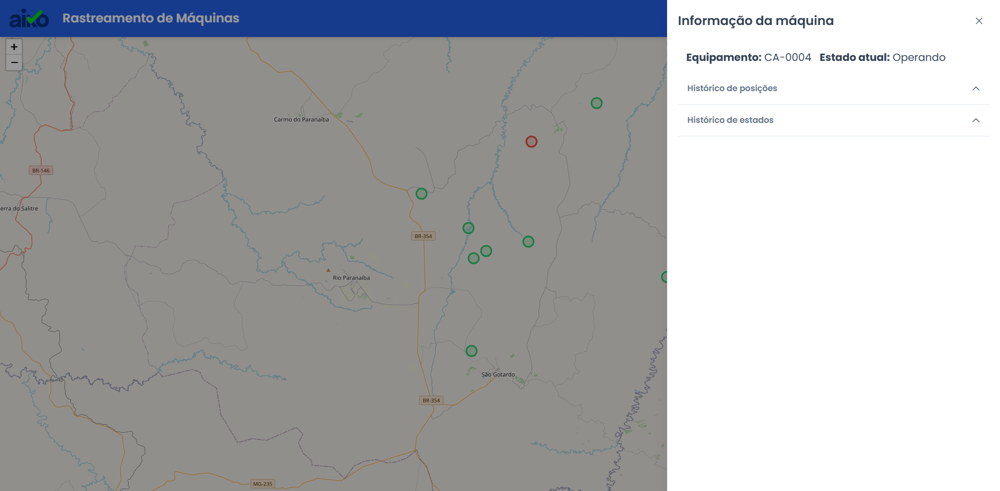
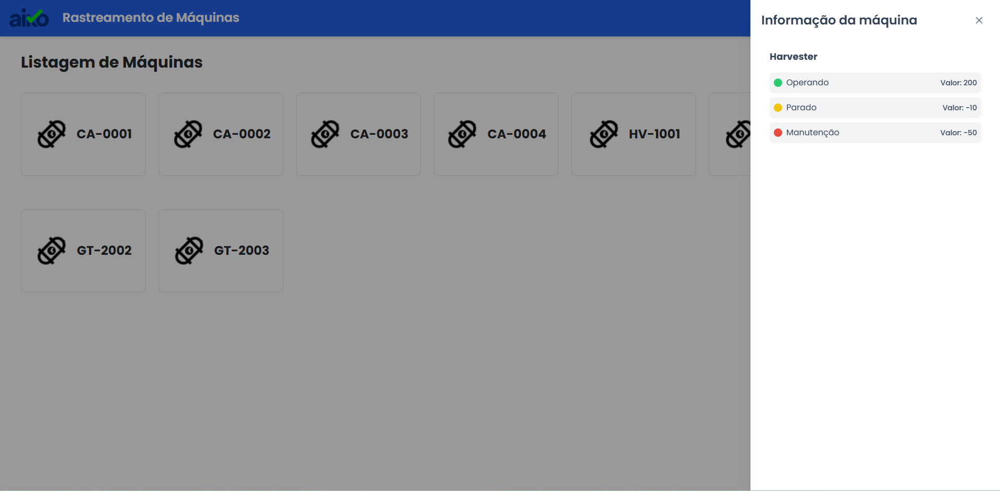

# Rastreamento de Máquinas

A aplicação oferece rastreamento de máquinas em tempo real, integrando recursos de localização e exibindo as informações de forma clara em um mapa interativo.

## Stack utilizada

**Front-end:** Vite, Vue 3, TailwindCSS, Primevue

## Instalação

Instale teste-frontend-v4 com yarn. Antes da instalação, mude de branch para poder seguir os passos de instalação.

Entre na seguinte branch:

```bash
  git checkout teste/maikon-guimaraes
  cd teste-frontend-v4
  yarn 
  yarn dev
```


## Screenshots












