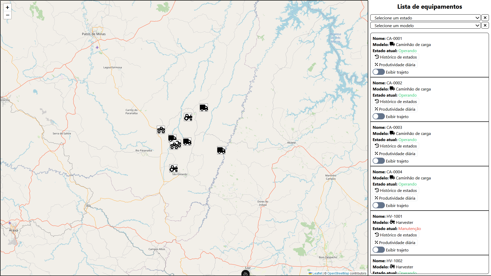

# Teste Frontend V4

## 📷 Galeria

Você pode encontrar outras fotos do projeto [aqui](https://github.com/oThinas/teste-frontend-v4/tree/teste/thiago-martins-prado/.github/img).

## 📝 Funcionalidades

- Posição dos equipamentos nas suas posições mais recentes;
- Visualização do estado do equipamento no mapa via pop-up;
- Visualização do histórico de estados de um equipamento específico;
- Visualização do histórico de posições de um equipamento específico;
- Filtragem para visualizar equipamentos por estado e por modelo;
- Relatório diário de cada estado do equipamento com quantidade de horas, percentual de estado e ganhos totais;
- Diferença visual dos equipamentos baseado no modelo; 

## 💻 Tecnologias

Esse projeto foi desenvolvido com:

- Typescript;
- Nuxt;
- Tailwind;
- Radix;
- Leaflet.
