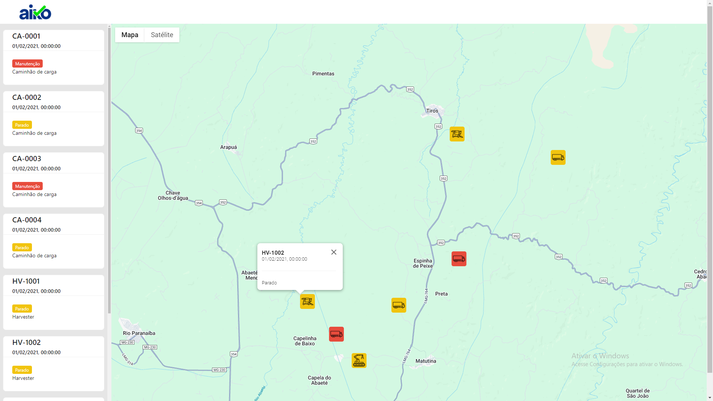
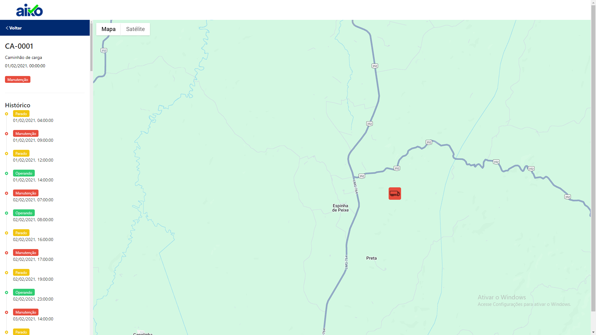

# Teste Front-end Aiko - Pedro Woyames

Teste realizado para a vaga de desenvolvedor front-end na Aiko.

### Visão Geral

Esse projeto foi construído em [Next](https://nextjs.org/), um framework React. Além disso, foram utilizados os seguintes pacotes:
- [Sass](https://sass-lang.com/) para pré-processamento CSS
- [React Google Maps](https://visgl.github.io/react-google-maps/) para exibição do mapa
- [Ant Design](https://ant.design/) para biblioteca de componentes e ícones

### Rodando o projeto

Para executar o projeto localmente, é necessário ter instalado o NPM. Após isso, basta executar os seguintes comandos:
```
npm install
npm run dev
```

O projeto estará disponível na URL http://localhost:3000 ou http://localhost:3001.

### Componentes e Comportamento

A home do projeto consiste em uma visão geral de todos os equipamentos em suas últimas posições e estado informados. 



Ao passar o mouse em algum dos equipamentos no mapa, é exibida uma janela contendo informações sobre o último estado reportado e a data.
Também é possível clicar nos equipamentos listados na barra lateral à esquerda para visualizar detalhes sobre o equipamento.



Na visualização de detalhes, é exibido em destaque a posição mais recente do equipamento, junto com seu estado e modelo. Também é exibido, em formato de linha do tempo, um histórico dos estados reportados ordenados a partir da data mais recente.