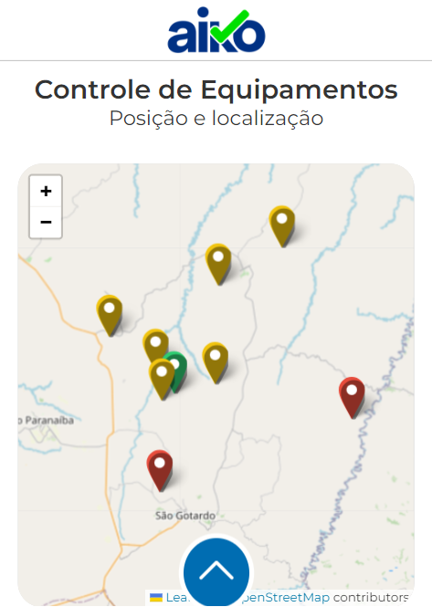
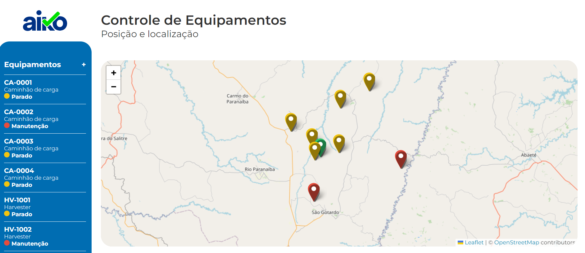

# Teste Frontend V4


## 📖 Introdução
Este repositório é a resolução do desafio proposto pela Aiko Digital, com o objetivo de demonstrar habilidades em desenvolvimento web, focado em front-end. O projeto é uma aplicação web de gestão de equipamentos utilizados em operação florestal, para acompanhamento de histórico de posições e estados pelos gestores da operação.

A aplicação foi estruturada para atender aos requisitos especificados no desafio, que inclui a avaliação dos conhecimentos em Javascript, HTML e CSS. O projeto visa não apenas resolver o desafio, mas também seguir boas práticas de desenvolvimento e arquitetura, garantindo código limpo, modular e escalável.

## 👥 Equipe
| [<br><sub>Daniel Emidio</sub>](https://github.com/DanielEmidio1988) |
| :---: |

## 🧭 Status do Projeto
- ⏳Concluído

## 📜 Escopo do Projeto

### O Desafio

Você é o desenvolvedor frontend de uma empresa que coleta dados de equipamentos utilizados em uma operação florestal. Dentre esses dados estão o histórico de posições e estados desses equipamentos. O estado de um equipamento é utilizado para saber o que o equipamento estava fazendo em um determinado momento, seja *Operando*, *Parado* ou em *Manutenção*. O estado é alterado de acordo com o uso do equipamento na operação, já a posição do equipamento é coletada através do GPS e é enviada e armazenada de tempo em tempo pela aplicação.

Seu objetivo é, de posse desses dados, desenvolver o frontend de aplicação web que trate e exibida essas informações para os gestores da operação.

### Requisitos

Esses requisitos são obrigatórios e devem ser desenvolvidos para a entrega do teste.

* **Posições dos equipamentos**: Exibir no mapa os equipamentos nas suas posições mais recentes.

* **Estado atual do equipamento**: Visualizar o estado mais recente dos equipamentos. Exemplo: mostrando no mapa, como um pop-up, mouse hover sobre o equipamento, etc.

* **Histórico de estados do equipamento**: Permitir a visualização do histórico de estados de um equipamento específico ao clicar sobre o equipamento.

Além disso, foi solicitado algumas sugestões extras, nas quais foram executados no projeto, como:

* **Filtros**: Filtrar as visualizações por estado atual ou modelo de equipamento.

* **Ganho por equipamento**: Calcular o ganho do equipamento com base no valor recebido por hora informado no Modelo de Equipamento. Exemplo se um modelo de equipamento gera 100 por hora em operando e -20 em manutenção, então se esse equipamento ficou 10 horas em operação e 4 em manutenção ele gerou 10 * 100 + 4 * -20 = 920.

### Arquitetura de pastas
- `📂 src ` - Pasta contendo os arquivos principais do projeto
  - `📂 assets` - Pasta com itens essenciais, de uso global
    - `📂 data` - Pasta com arquivos json
    - `📂 img`- Pasta de imagens do projeto
    - `📂 scss` - Pasta de estilo global
  - `📂 components` - Pasta de componentes do projeto
    - `📂 header` - Pasta dos componentes relacionado ao header/cabeçalho
    - `📂 mapEquipments` - Pasta dos componentes relacionados ao mapa
    - `📂 modal`- Pasta dos componentes relacionado ao modal/popup
    - `📂 navmenu` - Pasta dos componentes relacionado ao menu de navegação
  - `📂 context` - Pasta de context API do projeto
  - `📂 pages` - Pasta com todas as páginas do projeto
  - `📂 routes` - Pasta com todas as rotas do projeto
  - `📂 types` - Pasta com todas as tipagens globais

### Tecnologias e Recursos
Abaixo, listo todas as tecnologias e bibliotecas utilizadas:

* **React.js:** para criação de interfaces mais intuitiva e eficiente, com a utilização de componentes reutilizáveis, facilitando a manutenção e escalabilidade do projeto;
* **Typescript:** para ajudar a prevenir erros comuns em Javascript, como erros de tipo e nulos, tornando o código mais confiável, auxiliando a identificação de erros em tempo de desenvolvimento;
* **SCSS:** para permitir organizar os estilos CSS de forma mais lógica e hierárquica;
* **Leaflet:** para criação de mapas interativos personalizados, ampla documentação e comunidade ativa, facilitando a resolução de problemas;
* **React Router Dom:** para criação de multiplas rotas e páginas, pensando em escalabilidade e crescimento do projeto.

## 🎨 Layout

### Layout Mobile

|  |
| :---: |

### Layout Desktop

| <br> |
| :---: | 


## ⚙ Instalação

Antes de iniciar, certifique-se de ter o [Node](https://nodejs.org/pt/download/prebuilt-installer) instalado em sua máquina. Esta aplicação foi desenvolvida com o Node v18.

### Baixando a branch localmente

Abra o terminal Git na sua máquina, dentro da pasta onde deseja baixar o projeto, e execute o comando:

```
git clone --single-branch --branch teste/daniel https://github.com/aikodigital/teste-frontend-v4.git
```

### Instalação pacotes NPM
Durante o desenvolvimento do tema, utilizei alguns pacotes NPM que precisam ser instalados antes da execução do projeto. Para instalar, execute o comando:

```
npm install
```

### Execução do projeto
Após a instalação dos pacotes NPM, execute o comando abaixo para abrir o projeto localmente na localhost 3030:
```
npm start
```

## 💻 Utilizando o projeto
Por padrão, o mapa tem a localização inicial na região de Brasilia, caso não tenha nenhum dado de equipamento disponível. Caso haja informações de equipamentos, o mapa será reposicionado na região do primeiro equipamento da lista.

Ao clicar sobre um dos equipamentos do mapa, será exibido o resumo do ativo. Dentro do mesmo card, ao clicar em `+ Detalhes` ou no Equipamento listado no menu de navegação, será exibido todas as informações do equipamento como **Nome, Modelo, Estado, Dt. ultima posição, Produtividade e Histórico de Posições**. 

O menu de navegação pode ser localizado no lado esquerdo da tela na versão desktop, ou clicando no botão de seta na parte inferior da tela. Por padrão, ele exibirá primeiramente a lista de todos os equipamentos. Caso deseje filtrar todos os equipamentos por status, basta clicar em `Filtros`, escolher o Estado do equipamento e clicar em `Filtrar`. 