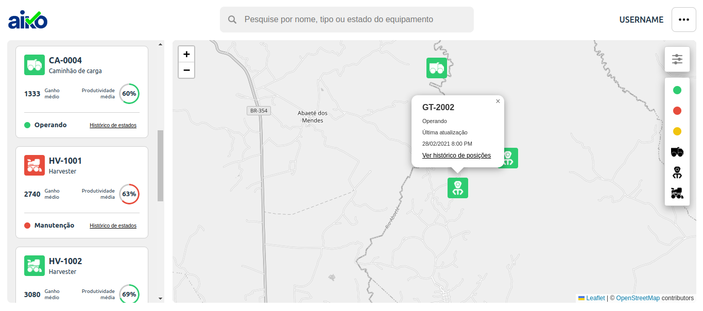

# Documentação da Aplicação

## *Visão Geral*
Esta aplicação React é uma plataforma que utiliza mapas interativos para visualizar dados de equipamentos. Os principais componentes incluem o [Navbar](#srccomponentsnavbar) o [Aside](#srccomponentsaside) o [Map](#srccomponentsmap) e a página [Home](#srcpageshome). A aplicação também faz uso do [Context API](#srccontextequipmentcontext) para gerenciar o estado global.

## *Como rodar o projeto*
- *Instalar dependências:* ```npm install```
- *Rodar servidor de desenvolvimento:* ```npm run dev```

## *Estrutura de componentes*

- *[App.tsx](#srcapp.tsx)*  
  Componente principal que renderiza a página [Home](#srcpageshome).

- *[Home.tsx](#srcpageshome)*  
  Componente de página que organiza a estrutura da aplicação, incluindo o [Navbar](#srccomponentsnavbar) [Aside](#srccomponentsaside) e [Map](#srccomponentsmap).

- *[Navbar.tsx](#srccomponentsnavbar)*  
  Barra de navegação no topo da aplicação, que inclui o logotipo, um campo de busca, e um botão de menu.

- *[Aside.tsx](#srccomponentsaside)*  
  Componente de barra lateral que pode ser usado para filtros e outras informações adicionais.

- *[Map.tsx](#srccomponentsmap)*  
  Componente que renderiza o mapa interativo usando react-leaflet. Inclui pontos de dados e históricos de posições. Vantagens de usar Leaflet:
  Código aberto e gratuito, leve e rápido, extensível, facilidade de uso

- *[Input.tsx](#srccomponentsinput)*  
  Componente de entrada (input) usado no [Navbar](#srccomponentsnavbar).

- *[EquipmentContext](#srccontextequipmentcontext)*  
  Contexto para fornecer e gerenciar o estado dos equipamentos globalmente na aplicação.

## *Data*
- *equipment:* Informações sobre equipamentos.
- *equipmentModel:* Informações sobre modelos de equipamentos.
- *equipmentPositionHistory:* Histórico de posições de equipamentos.
- *equipmentState:* Estados dos equipamentos.
- *equipmentStateHistory:* Histórico de estados dos equipamentos.

## *Types*
Os tipos de dados incluem interfaces para Equipamentos, Modelos de Equipamento, Histórico de Posições, Estados e Histórico de Estados.

## **Estrutura do Projeto**

```bash
src
├── assets
│   ├── icons
│   └── img
├── components
│   ├── Aside
│   │   ├── Aside.tsx
│   │   └── aside.module.css
│   ├── Card
│   │   ├── Card.tsx
│   │   └── card.module.css
│   ├── data
│   │   ├── EquipmentList.tsx
│   │   └── EquipmentModel.tsx
│   ├── filtros
│   │   ├── MenuFilter.tsx
│   │   └── menuFilter.module.css
│   ├── Map
│   │   ├── Map.tsx
│   │   └── map.module.css
│   ├── grafico
│   │   ├── Grafico.tsx
│   │   └── grafico.module.css
│   ├── Input
│   │   ├── Input.tsx
│   │   └── input.module.css
│   ├── Navbar
│       ├── Navbar.tsx
│       └── navbar.module.css
├── context
│   └── EquipmentContext.tsx
├── hooks
│   └── useEquipment.ts
├── pages
│   └── Home.tsx
├── types
│   └── types.ts
├── utils
│   ├── calculate.ts
│   └── dataOrganizer.ts
├── index.tsx
├── App.tsx
├── index.css
└── App.css
```

## *UI Design*
Diante da complexidade visual envolvendo cores, formas e a quantidade de informações, optei por um tema neutro que destaca apenas as informações essenciais. Utilizei ícones para diferenciar os equipamentos e dei especial atenção às cores dos estados dos equipamentos, garantindo que essas informações sejam claras e evidentes. Além disso, utilizei gráfico para tornar a leitura mais dinâmica e facilitar a identificação da produtividade dos equipamentos.

## *Preview*

