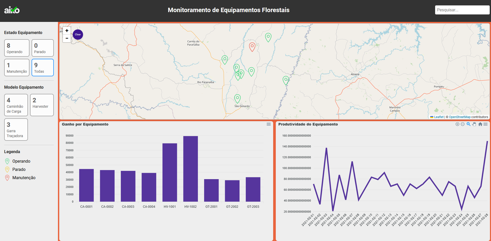

# Documentação do Projeto de Monitoramento de Equipamentos Florestais

## Visão Geral
Este projeto tem como objetivo monitorar e visualizar dados de equipamentos em operações florestais. A aplicação permite que gestores acompanhem a posição, o estado atual, o histórico de estados e o desempenho dos equipamentos.

## Tecnologias Utilizadas
- **React & TypeScript:** Para o desenvolvimento da interface do usuário.
- **Leaflet:** Para a visualização de mapas e marcadores.
- **ReactApexChart:** Para a geração de gráficos de produtividade e ganho.
- **Cypress:** Para testes end-to-end e de interface.

## Estrutura do Projeto
- **Components:** Componentes reutilizáveis, como `Header` e `FiltroCard`.
- **Containers:** Contêm a lógica de negócio e interações mais complexas, como `MapaLocalizacao` e `BarraLateral`.
- **Utils:** Cálculos e lógica específica de produtividade e ganhos.

## Funcionalidades

### 1. Input de Busca
O campo de busca permite pesquisar o estado ou o modelo de qualquer equipamento.

### 2. Mapa de Localização
Exibe a posição atual dos equipamentos com ícones de cor diferenciada para cada estado. Ao clicar passar o mouse é possível visualizar o nome , modelo e estado do Equipamento.
Ao clicar dispara outra ação que é a visualização do histórico de posição e historico de estados e logo apos vem o trajecto feito individual.

### 3. Botão "Clear" no Mapa
Implementei o botão "Clear" para limpar o histórico de trajetos individualmente no mapa, permitindo maior flexibilidade na visualização do histórico de trajeto de cada equipamento.

### 4. Filtros de Estado e Modelo
Filtros permitem que o usuário visualize apenas os equipamentos que estão em determinado estado (Operando, Parado, Manutenção) ou que pertencem a um determinado modelo.

### 5. Gráficos de Produtividade e Ganho
Gráficos interativos mostram o desempenho dos equipamentos em termos de produtividade (percentual de tempo operando) e ganhos (calculados com base nos estados e horas de operação).

## Testes
Os testes foram realizados com Cypress para garantir que os filtros, o mapa, e os elementos principais da interface funcionem corretamente.

## Decisões Técnicas
- **Leaflet:** Escolhido para a visualização do mapa devido à sua flexibilidade e suporte a camadas customizadas.
- **ReactApexChart:** Utilizado para gráficos devido à sua simplicidade e bom suporte a gráficos interativos.
- **Tooltip:** Para ter efeito houver ao passar o mouse.
- **Cypress:** Utilizado para testes automatizados, garantindo a integridade da interface em diversas situações.

## Link para a Aplicação
- [Link para o Vercel](https://monitoring-lake.vercel.app/)

## **Responsividade: ** O projeto foi desenvolvido com foco na responsividade, garantindo que a interface se adapte a diferentes tamanhos de tela, desde dispositivos móveis até monitores de grande porte.

## Considerações Finais
Este projeto implementa as principais funcionalidades de monitoramento, com filtros avançados e gráficos interativos. Futuras melhorias podem incluir a visualização de trajetos históricos em tempo real.

## Visualização da Interface

visualização da interface do projeto:

## Demonstração em Vídeo

[Assista ao vídeo da demonstração](./public/Monitoring.mp4)
