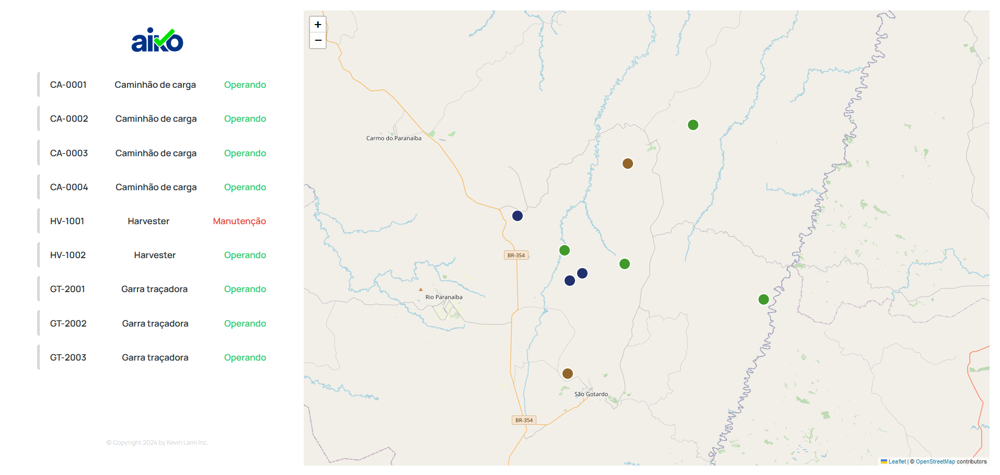

# Aiko Test

## Description

You are the frontend developer for a company that collects data from equipment used in forestry operations. Among this data are the historical positions and states of the equipment. The state of a piece of equipment is used to indicate what the equipment was doing at a particular moment, whether it was Operating, Idle, or Under Maintenance. The state changes according to the equipment's usage in the operation, while the equipment’s position is collected via GPS and sent and stored periodically by the application.

Your goal is to use this data to develop the frontend of a web application that processes and displays this information to the operation managers.

## Requirements

These requirements are mandatory and must be developed for the test delivery.

    Equipment positions: Display the equipment on the map at their most recent positions.

    Current equipment state: View the most recent state of the equipment. For example, showing it on the map as a pop-up, mouse hover over the equipment, etc.

    Equipment state history: Allow viewing the state history of a specific piece of equipment when clicking on the equipment.

## Images

<p float="left">
  
  
  
  
</p>

## Technologies Used

- React
- Vite
- Css Module
- Json Server
- leaflet
- Eslint
- noje.js

## How to run

The project uses noje.js to work.

Commands to run the projects:

server:

```bash
npm run server
```

client:

```bash
npm run dev
```
