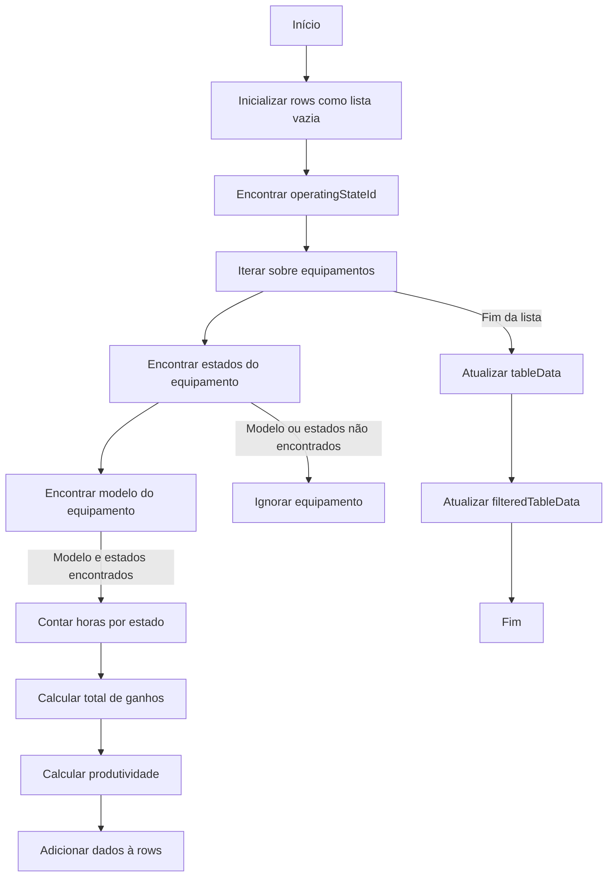

Este Markdown file utiliza MERMAID para fluxogramas, se nao carregar o fluxograma utilize o site https://mermaid.live/ e cole os codigos abaixo para visualizar.

Ao entrar na dashboard o metodo calculateEquipmentEarnings() é executado para obter informacoes individuais de cada equipamento:

## Explicacao passo-a-passo do fluxograma

- Início: O processo começa.
- Inicializar rows como lista vazia: A variável rows é inicializada como uma lista vazia para armazenar os dados da tabela.
- Encontrar operatingStateId: A função busca o ID do estado "Operando" na lista de estados.
- Iterar sobre equipamentos: A função calculateEquipmentEarnings começa a iterar sobre cada equipamento na lista equipments.
- Encontrar estados do equipamento: Para cada equipamento, a função busca os estados correspondentes na lista equipmentStates.
- Encontrar modelo do equipamento: A função também busca o modelo do equipamento na lista models.
- Modelo e estados encontrados: Se tanto o modelo quanto os estados forem encontrados, os seguintes passos são executados:
- Contar horas por estado: A função countHoursByState é chamada para contar as horas em cada estado.
- Calcular total de ganhos: A função calculateTotalEarnings é chamada para calcular os ganhos totais com base nas horas contadas e no modelo do equipamento.
- Calcular produtividade: A função calculateProductivity é chamada para calcular a produtividade do equipamento.
- Adicionar dados à rows: Os dados calculados (nome do equipamento, modelo, ganhos e produtividade) são adicionados à lista rows.
- Modelo ou estados não encontrados: Se o modelo ou os estados não forem encontrados, o equipamento é ignorado.
- Fim da lista: Quando todos os equipamentos foram processados, o fluxo continua para a próxima etapa.
- Atualizar tableData: A variável tableData.value é atualizada com os dados armazenados em rows.
- Fim: O processo é concluído.
