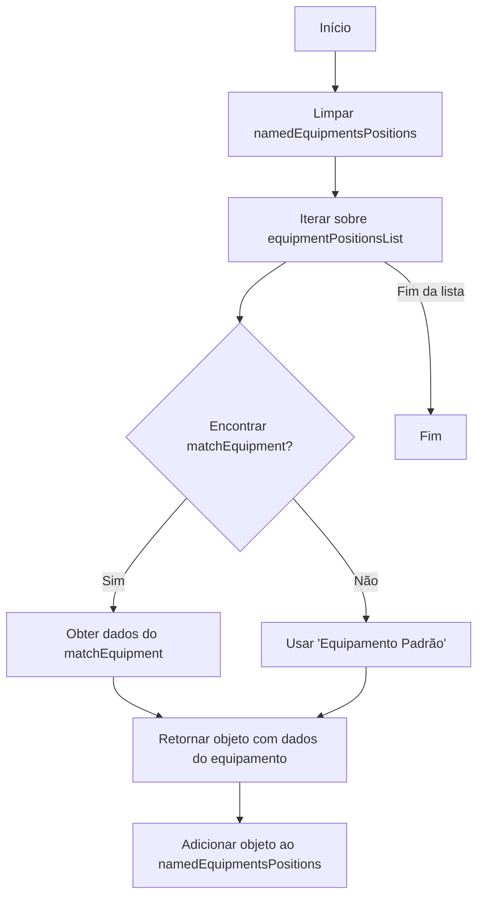
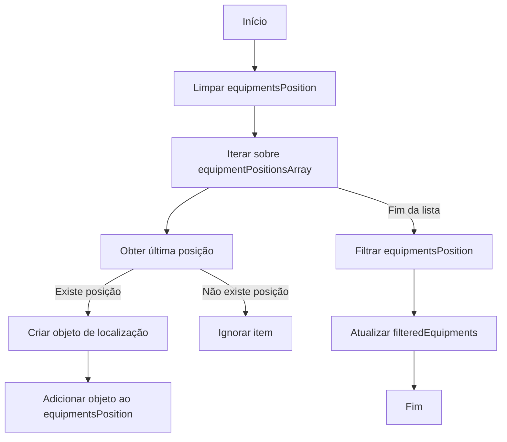

Este Markdown file utiliza MERMAID para fluxogramas, se nao carregar o fluxograma utilize o site https://mermaid.live/ e cole os codigos abaixo para visualizar.

Ao montar a view, o metodo createMappedByNameEquipmentPositionsArray() é executado para criar um objeto com mapeamento de cada equipamento: Fluxo abaixo

## Explicacao passo-a-passo do fluxograma acima

- Início: O processo começa.
- Limpar namedEquipmentsPositions: A variável namedEquipmentsPositions.value é inicializada como uma lista vazia.
- Iterar sobre equipmentPositionsList: A função começa a iterar sobre cada item em equipmentPositionsList.
- Encontrar matchEquipment?: Para cada equipmentPositionItem, a função verifica se existe um equipamento correspondente na lista equipmentsList com base no equipmentId.
- Sim: Se um equipamento correspondente for encontrado, os dados desse equipamento são obtidos.
- Não: Se não houver correspondência, a função utiliza 'Equipamento Padrão'.
- Retornar objeto com dados do equipamento: Um objeto é retornado com as informações do equipamento ou com os dados padrão.
- Adicionar objeto ao namedEquipmentsPositions: O objeto retornado é adicionado à lista namedEquipmentsPositions.
- Fim da lista: Quando todos os itens da lista foram processados, o fluxo termina.
- Fim: O processo é concluído.

Apos isso o metodo createLocationsArray() é executado para obter a localizacao de cada equipamento

## Explicacao passo-a-passo do fluxograma acima

- Início: O processo começa.
- Limpar equipmentsPosition: A variável equipmentsPosition.value é inicializada como uma lista vazia.
- Iterar sobre equipmentPositionsArray: A função createLocationsArray começa a iterar sobre cada item em equipmentPositionsArray.
- Obter última posição: Para cada item, a função getLastPosition é chamada para obter a última posição do equipamento.
- Existe posição: Se houver pelo menos uma posição, a última posição é obtida.
- Não existe posição: Se não houver posições, o item é ignorado.
- Criar objeto de localização: Se uma posição válida for encontrada, a função createLocationObject é chamada para criar um objeto de localização com base na última posição, nome do equipamento, ID e ID do modelo do equipamento.
- Adicionar objeto ao equipmentsPosition: O objeto de localização criado é adicionado à lista equipmentsPosition.value.
- Fim da lista: Quando todos os itens da lista foram processados, o fluxo continua para a próxima etapa.
- Filtrar equipmentsPosition: A lista equipmentsPosition.value é filtrada para remover quaisquer objetos nulos que possam ter sido adicionados durante o processo de mapeamento.
- Atualizar filteredEquipments: A variável filteredEquipments.value é atualizada com a lista filtrada de objetos de localização.
- Fim: O processo é concluído.
